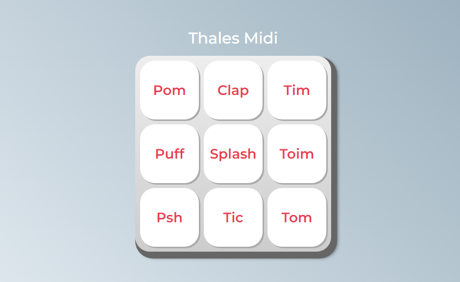

# Thales - Midi

This is my third project with HTML and CSS and now I'm venturing into JavaScript,
A virtual drum was created to reproduce some sounds, a very simple project that made me use some techniques
in JavaScript that I hadn't seen before. // Esse é meu terceiro projeto com HTML e CSS e agora me aventurando por JavaScript,
Foi criado uma bateria virtual para reproduzir alguns sons, um projeto bem simples que me fez usar algumas técnicas
em JavaScript que eu ainda não havia visto.

## Funcionalidades // Functionalities

- Reproduzir sons de uma bateria // Play drum sounds
- Se divertir // Have fun 😅😅
- Interface de usuário intuitiva e amigável. // Intuitive and friendly user interface.

## Modos de Uso ##

Apenas clicar nos botões do display e criar seus ritmos!! // Just click on the display buttons and create your rhythms!!
- Funciona em Mobile // Works on Mobile

                  Feito por Thales // Made by Thales
